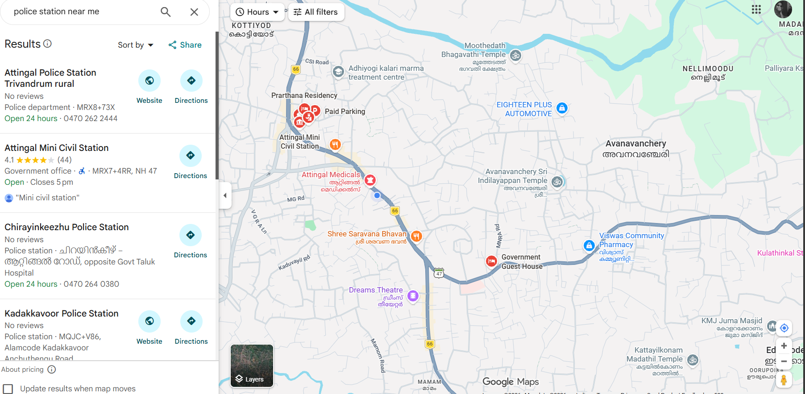
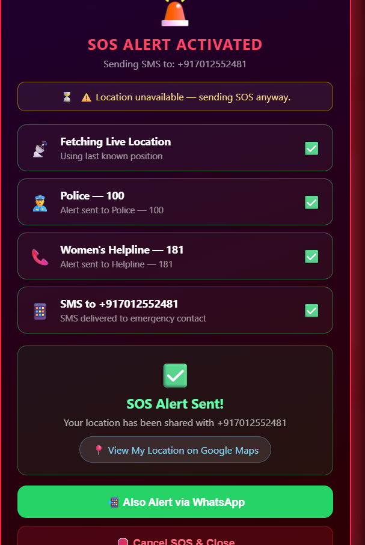

<p align="center">
  
</p>

# SafeZone 🎯

## Basic Details

### Team Name: Evolve

### Team Members
- Member 1: [HISANA FATHIM S] - [COLLEGE OF ENGINEERING ATTINGAL]
- Member 2: [THANISHMA SHANOJE] - [COLLEGE OF ENGINEERING ATTINGAL]

### Hosted Project Link
[Backend (Render)](https://safezone-backend-u5vd.onrender.com/)
[Frontend (Vercel)](https://evolve-rose.vercel.app/)

### Project Description
SafeZone is a lightweight safety application designed to provide immediate SOS alerts. With a single tap, it fetches your live location, notifies emergency contacts via SMS and WhatsApp, and provides shortcuts to nearby safe spots like police stations and hospitals.

### The Problem statement
Personal safety is a major concern, especially when alone or in unfamiliar areas. Traditional methods of seeking help (making a call) can be slow or impossible in high-stress situations.

### The Solution
SafeZone simplifies emergency signaling by automating location sharing and multi-channel alerting (SMS, WhatsApp, Manual Fallback) through a simple, high-visibility interface.

---

## Technical Details

### Technologies/Components Used

**For Software:**
- Languages used: JavaScript (ES6+), HTML5, CSS3
- Frameworks used: Express.js (Backend)
- Libraries used: Leaflet.js (Maps), Axios, CORS, Dotenv
- Tools used: VS Code, Git, Render,Vercel


## Features

List the key features of your project:
- Feature 1: Instant SOS Alert - Sends automated SMS with live location.
- Feature 2: High-Accuracy GPS Tracking - Real-time location display on interactive map.
- Feature 3: Multi-channel Notification - WhatsApp and manual SMS fallback options.
- Feature 4: Safe Spot Navigator - One-tap search for nearby police stations and hospitals.

---

## Implementation

### For Software:

#### Installation
```bash
# Backend
cd backend
npm install

# Frontend
# No installation needed for vanilla HTML/CSS/JS
```

#### Run
```bash
# Backend
cd backend
npm start

# Frontend
# Open frontend/index.html in a browser or use a Live Server
```


## Project Documentation

### For Software:

#### Screenshots (Add at least 3)




#### Diagrams

**System Architecture:**


USER DEVICE-FRONTEND INTERFACE-BACKEND SERVER(Node.js)-Fast2SMS-Emergency Contact Receive Alert

**Application Workflow:**


*Add caption explaining your workflow*

---


#### Build Photos


*List out all components shown*


*Explain the build steps*


*Explain the final build*

---

## Additional Documentation

### For Web Projects with Backend:

#### API Documentation

**Base URL:** `https://safezone-backend.onrender.com`

##### Endpoints

**POST /send-sos**
- **Description:** Receives emergency details and triggers real-time SOS alerts.
- **Request Body:**
```json
{
  "name": "User Name",
  "emergencyContact": "+91XXXXXXXXXX",
  "location": "Lat: 12.345, Lng: 67.890"
}
```
- **Response:**
```json
{
  "success": true,
  "message": "SOS Alert sent successfully via Fast2SMS."
}
```

[Add more endpoints as needed...]

---


## Project Demo

### Video
[https://drive.google.com/file/d/1QleXHH1PGZHxtcH5_lQWjOQj35n6oREn/view?usp=sharing]

*Explain what the video demonstrates - key features, user flow, technical highlights*


## AI Tools Used (Optional - For Transparency Bonus)

If you used AI tools during development, document them here for transparency:

**Tool Used:** Antigravity (Advanced Agentic AI)

**Purpose:** 
- Architecture design and backend-frontend integration.
- Implementing SOS fallback mechanisms and Fast2SMS API integration.
- Deployment preparation and documentation support.

**Key Prompts Used:**
- "Connecting Frontend and Backend"
- "Implementing SOS Fallback"
- "Integrate real Fast2SMS API"
- "Deploy the project"

**Percentage of AI-generated code:** [Approximately X%]

**Human Contributions:**
- Architecture design and planning
- Custom business logic implementation
- Integration and testing
- UI/UX design decisions

*Note: Proper documentation of AI usage demonstrates transparency and earns bonus points in evaluation!*

---

## Team Contributions

- [HISANA FATHIM S]: [Specific contributions - e.g., Frontend development, API integration, etc.]
- [THANISHMA SHANOJE]: [Specific contributions - e.g., Backend development, Database design, etc.]

---


Made with ❤️ at TinkerHub
